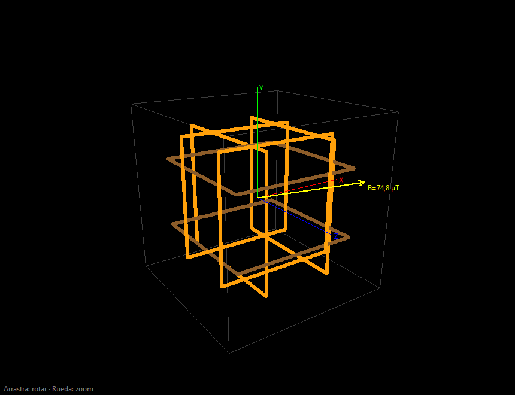
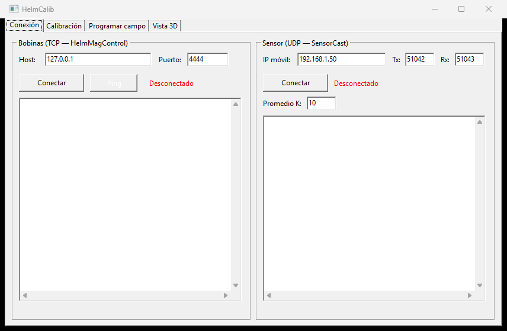

# HelmCalib

Magnetic-field **calibration** and **open-loop field programming** for a 3-axis
Helmholtz coil system (Bartington **BHC2000**), with a built-in 3D view of the
generated field vector.



The app drives the three coil axes through
[HelmMagControl](https://github.com/ebalvis) (TCP) and measures the resulting
field with the magnetometer of a phone running
[SensorCast](https://github.com/ebalvis/SensorCast) (UDP). From those samples it
fits the affine model `B = M·I + b` and, once calibrated, computes the currents
needed to generate a requested target field.

> Lab tool. Primary version in **Lazarus / Free Pascal** (LCL), cross-platform,
> with no external dependencies (UI and 3D drawn on `Canvas`, networking on the
> RTL sockets, JSON via `fpjson`). A **Delphi (VCL)** port lives in
> [`delphi/`](delphi/) — see below.

## Features

- **Connection** (live): TCP client for HelmMagControl (`READ ALL` polling) and
  UDP client for SensorCast (magnetometer + K-sample averaging).
- **Calibration wizard**: automatic current sweep → settle → average K samples →
  least-squares fit. Manual point capture, RMS residual, and profile save/load (JSON).
- **Open-loop field programming**: given a target B vector (coil frame), it computes
  the currents with per-axis clamping, warns on saturation, and shows the actually
  achievable field. A nominal catalog model is available before calibrating.
- **3D view**: wireframe of the support cube and the three square Helmholtz coil
  pairs to scale, plus the B-vector arrow. Rotate with the mouse, zoom with the
  wheel, drawn on `Canvas` with no 3D libraries. Coils on the dominant axis of the
  target field are highlighted.

## Calibration math

Sensor frame: `B = M·I + b`, with `M` 3×3 (µT/A) and `b` 3×1 (µT, ambient field).

- **Fit** (least squares, normal equations):
  `A = [M|b] = (Σ Bₖ·xₖᵀ)·(Σ xₖ·xₖᵀ)⁻¹`, with `xₖ = [Iₖ; 1]`. Needs ≥ 4 non-coplanar
  points (including I = 0).
- **Polar decomposition** `M = R·G` (Jacobi on `MᵀM`): `R` coil→sensor rotation,
  `G` symmetric gain ≈ diag(kₓ, k_y, k_z).
- **Open loop**: `I = G⁻¹·(B_target − Rᵀ·b)`, then clamp to ±I_max per axis.

## Architecture

| Unit | Responsibility |
| --- | --- |
| `uMatrix` | 3×3/4×4 linear algebra: inverses, least squares, Jacobi, polar/SVD. |
| `uCoils`  | TCP client for the HelmMagControl text protocol (pure protocol logic + `TCoilClient`). |
| `uSensor` | UDP client for SensorCast (pure `ParseSensorJSON` + threaded `TSensorClient`). |
| `uCalib`  | `B=M·I+b` model: points, fit, polar decomposition, RMS residual, JSON profile, nominal/manual model. |
| `uField`  | Open-loop field programming: inverse + clamp + achieved field + send. |
| `uView3D` | `TView3DPanel`: wireframe 3D view drawn on `Canvas`. |
| `uMainForm` | Main form with the four tabs. |

## Application



Four tabs: **Connection · Calibration · Program field · 3D view**.

## Build & test

Requires **Lazarus / FPC 3.2.2**.

```sh
# GUI app -> lib/x86_64-win64/HelmCalib.exe
bash build.sh

# Console tests for the logic (105+ assertions, exit = number of failures)
bash tests/run.sh
```

`build.sh` generates the project resource (`HelmCalib.res`, with a manifest for
themes/DPI) via `fpcres` before invoking `lazbuild`. You can also open
`HelmCalib.lpi` directly in the Lazarus IDE.

## Delphi (VCL) port

[`delphi/`](delphi/) contains an equivalent **Delphi (VCL, Win64)** version, tested
with **RAD Studio Athens (Delphi 37.0)**. Same architecture and the same units;
only the platform dependencies differ:

- Networking: **Indy 10** (`TIdTCPClient`, `TIdUDPClient`) instead of the RTL sockets.
- JSON: **System.JSON** instead of `fpjson`.
- UI/3D: **VCL** (`Vcl.*`) with `.dfm` instead of LCL/`.lfm`.

```sh
cd delphi
bash build.sh          # GUI -> delphi/HelmCalib.exe (or open HelmCalib.dproj in the IDE)
bash tests/run.sh      # 115 logic assertions, exit = number of failures
```

The logic is covered by the same console tests (115 assertions); the GUI and 3D
view were verified on Win64.

## Reference hardware

- **Coils:** Bartington BHC2000 (3 orthogonal pairs). Model A: ~25 µT/A, 1.0 mT/axis,
  40 A. Model B: ~15 µT/A, 240 µT/axis, 16 A.
- **Actuator:** Wanptek power supplies via HelmMagControl, TCP text protocol (port 4444).
- **Sensor:** Android phone running SensorCast at the center of the coils (UDP, JSON every 200 ms).

## Status

All four tabs (Connection · Calibration · Program field · 3D view) are operational.
The logic is covered by console tests with synthetic data; the network I/O compiles
and the protocol/parsing logic is verified — end-to-end testing against the real
hardware is left for commissioning.

See [CHANGELOG.md](CHANGELOG.md) for the per-version detail.
